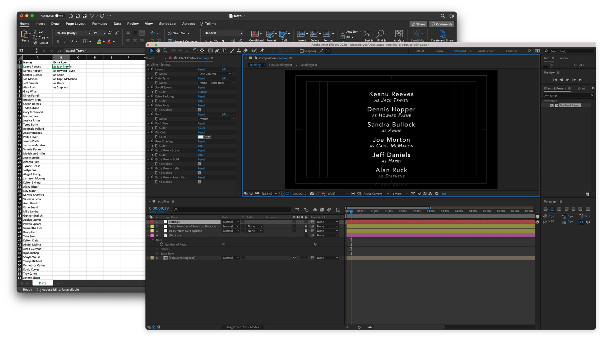

# ae-scrolling-credits
 Turn a spreadsheet into simple scrolling text in After Effects.
 
 Perfect for creating film credits or a scrolling list of names for a commencement or graduation.

[Download the .zip](https://github.com/bryce-seifert/ae-scrolling-credits/archive/main.zip) containing the project and a template .csv

To use:
* Open the included Data.csv template and paste all of the desired names under the "Names" column
* *Optional: Paste additional info you want grouped with each name (the character they played, graduting "with honors") in the "Extra Row" column*
* Save the Data.csv file
* Launch the scrolling.aep file
* Ensure the "Number of Rows" under the Data.csv layer is the number of rows you are expecting. Adjust if needed (Note: AE does not auto update this value if you save a new version of the .csv and there are *additional* rows)
* Adjust various parameters in the Effects Controls window of the Settings layer
* Trim your comp to the amount of time it takes all of the names to scroll through the frame and export!

Available Paramaters:
* Layout (One Column or Two Columns)
* Data Type (Name + Extra Row or Name Only)
* Scroll Speed
* Edge Padding
* Edge Fade
* Font
* Font Size
* Fill Color
* Row Spacing
* Extra Row – Scale
* Extra Row – Bold
* Extra Row – Italic
* Extra Row – Small Caps